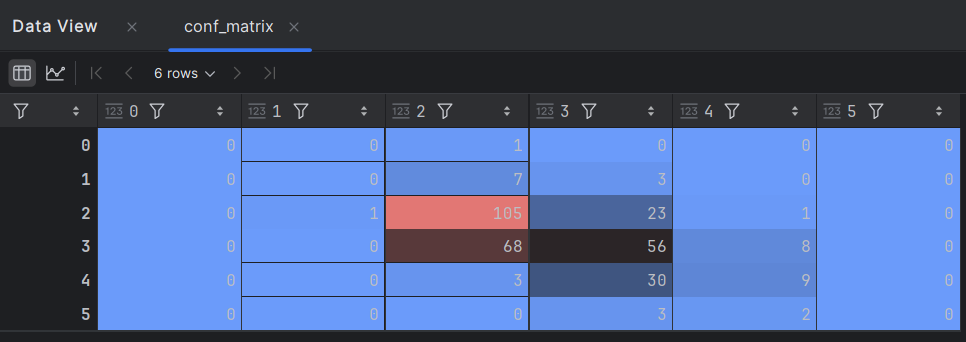
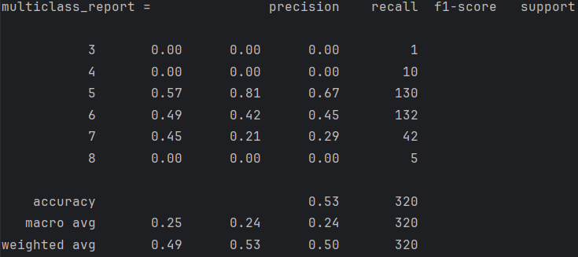
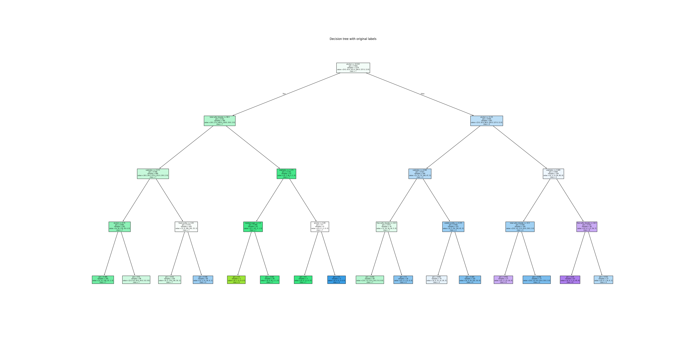
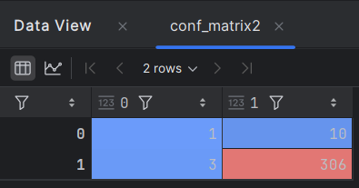
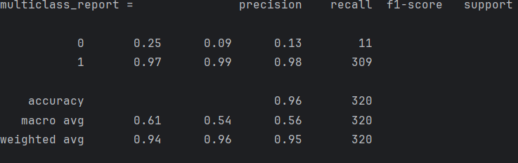
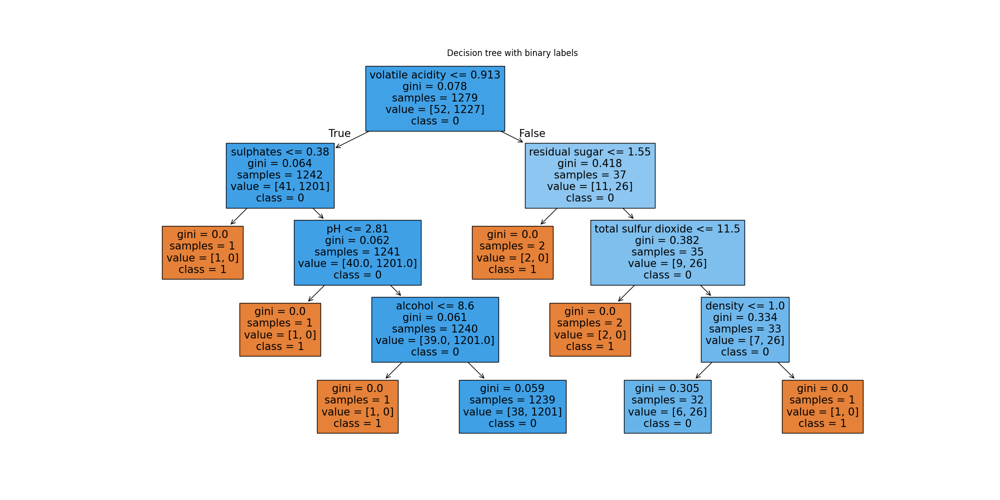

# Wine Quality Prediction

## Project Overview

This project aims to predict the quality of red wine based on various chemical properties using machine Decision Tree Classifier. 
I train a model using a decision tree classifier to evaluate the wine's quality, which is scored on a scale from 3 to 8.
The project demonstrates preprocessing, training, evaluation, and visualization for classification tasks in machine learning.

## Result Analysis

Training the model with the original labels (multi-class) lead to not very good results : ~ 53% accuracy.

The performance fluctuates depending on the labels : 

Then I tried to train the model using binary classification (high/low quality of the wine).
Good results : ~ 96% accuracy

